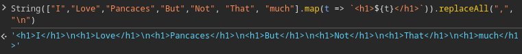

# Source code of kanby.net

### Author Zayd al-Muqaddim al-Qamar al-‘Aarabi

## Tech stack:

### FRONTEND

- Vanilla JS - For better speed and Better SEO

### Backend

- Node JS,
- Express JS,

### DATABASE

- Postgres SQL

---

### SQL db setup codes

without this tables set up, code will throw error :)

```SQL

 CREATE TABLE users (id serial primary key, login_name text, creation_date text, password_hash text, profile_picture_url text, privilege text, public_name text)

```

```SQL
 CREATE TABLE variables (key text, value text[])

```

```SQL
 CREATE TABLE blogs (id serial primary key, title text, description text, language text, author text, creation_date text, last_modify_date text, thumbnail_url text, rendered_content text, raw_content text)
```

```SQL
 CREATE TABLE media (id serial primary key, full_url text, alt_text text)
```

### Template literal guides,

#### To list html repetadly

```js
String(
	(await Index.pool.query(`SELECT * FROM "variables"`)).rows[0].value.map(t => {
		return `
<option value="" selected disabled hidden>language</option>

	<option value="${t}">${t}</option>
`;
	}),
).replaceAll(",", "\n");
```



it is similar to React, we use string instead of JSX.

this code does not let us use comma(,) inside strings, and that is a problem.

use this ->

```js
console.log(
	"".concat(
		...[1, 2, 3, 4, 6].map(t => {
			return `tetetetet`;
		}),
	),
);
```

BUT, if you will run async function inside of map, it will return you an array of promises, you need to resolve it with Promise.all(array of promises).

```js
<select
	required
	id="blog-form-language-edit">
	$
	{async () => {
		return await Promise.all(
			(await Index.pool.query(`SELECT * FROM "variables"`)).rows[0].value.map(async r => {
				return await construct`

	<option ${() => {
		if (t.language == r) {
			return "selected";
		} else {
			return "";
		}
	}}  value="${() => r}">${() => r}</option>
`;
			}),
		);
	}}
</select>
```
so final touch is this, you can use as much of async awaits and construct tag as you want

```js

	${async () => {
		return "".concat(...(await Promise.all(
			[1,2,3,4].map(t => {

})
		)))
	}}

```


#### Running code inside of template literal.

- #### Syncronus

```js

${(()=> {return 1+1})()}

```

- #### asyncronus

Template literals does not support async await or .then, so we will take an extra step.

the way i use template literal requires Tagged Templates, which is running template literal in a function and manipulate it. I was using it for prettier support but i realized that it will make Async operations possible too.

code for prettier support:

```js
const html = (x, ...values) => {
	var rendered = "";
	for (let u = 0; u < x.length; u++) {
		rendered = rendered.concat(x[u]);
		if (u < x.length - 1) rendered = rendered.concat(values[u]);
	}
	return rendered;
};

console.log(html`
	Template String
`);
```

Or

```js
const html = (x, ...values) => {
	return strings.reduce((acc, str, i) => acc + str + (i < values.length ? values[i] : ""), "");
};

console.log(html`
	Template String
`);
```

We need to change this function a little bit and we will change the way we write functions in template strings.

```js
const html = async (x, ...values) => {
	var rendered = "";
	for (let u = 0; u < x.length; u++) {
		rendered = rendered.concat(x[u]);
		if (u < x.length - 1) {
			if (typeof values[u] == "function") {
				rendered = rendered.concat(await values[u]());
			} else {
				rendered = rendered.concat(values[u]);
			}
		}
	}

	return rendered;
};
```

so basically the snippet above lets us write pure functions inside template literals, and if that function returns something, it will put that into string

```js

${() => {return "test"}}


```

```js
console.log(
	await html`
		<div class="A5ueMP-cotnainer">
			${async () => {
				return String(
					(await Index.pool.query(`SELECT * FROM "variables"`)).rows[0].value.map(
						t => `
						<h1>${t}</h1>
					`,
					),
				).replaceAll(",", "\n");
			}}
			${() => {
				return "<h1>My fancy header</h1>";
			}}

			<h1>Blogs</h1>
		</div>
	`,
);
/* Output ->

<div class="A5ueMP-cotnainer">
 
<h1>Data1</h1>
<h1>Data2</h1>
<h1>Data3</h1>
<h1>Data4</h1>

		<h1>Blogs</h1>
	
    </div>

    */
```

basically, our tag function runs the function we provided in templated string and add its value to rendered string in order.

#### to render html that contains squarebrackets(&#34;) inside js with innerHTML

<code>&#96;document.querySelector(".class").innerHTML = &#92;&#96; &lt;div&gt;Complex HTML&lt;/div&gt; &#92;&#96; &#96;</code>

## Fetch component from server and render it on client

`/get-component/[admin | visitor]/[component_name]`

With the API above you can fetch components from server,
this API returns a json object with 2 elements inside
first is rendered html string,
second is rendered JS string.

both of these strings are rendered on server, the fetch method is post, so you can send data to server before render to add stuff inside to both js and html.

if you do not create a script tag and append it to DOM, script will not run. I mean innerHTML does not run scripts.

```js
document.querySelector(".V6bMFQ-loading").classList.add("active");
fetch("/get-component/admin/AdminBlogs", {
	headers: { "Content-Type": "application/json" },
	body: JSON.stringify({ message: "User Not Found" }),
	method: "POST",
})
	.then(e => {e,e.json()})
	.then((e, json) => {

		document.querySelector(".V6bMFQ-loading").classList.remove("active");
		document.querySelector(".V6bMFQ-main-area-content").innerHTML = json.html;
		var eaa = document.createElement("script");
		eaa.innerText = json.js;
		document.querySelector(".A5ueMP-cotnainer").prepend(eaa);
	}).catch(e){alert("Fetch Error")};
```

Or you can create blob of js string and append script tag inside head tag with a src pointing to blob url

### Features

1. All development progress of this software will be available on this git repository.
2. Dockerfile will be available in every stable release.
3. **Error handling** and **cybersecurity** side will not be neglected.

```
- Blogs, news, Content and Static pages will be created on admin panel via markdown(.md)
- Users will have privileges
- SEO tools will be available from admin panel.
- Multi languages and their configuration is supported, all settings will be done from admin panel
- Frontend will recognise user and will render a different type of frontend for current user upon users privileges (eg. edit post button on spesific post)
- Everything must be responsive, specially admin panel. this wil let user modify & create content to website from anywhere
```

### Possible Features

```
- currently I was planning to make frontend design process by purely on code, but there may be pre-coded responsive frontend components which are customisable and user can sort them upon his/her own design. Like a few header component, a few footer component, Hero, Testimonials, Slider and etc. and all components will be compatible with each other.
- There may be a component creation page on admin panel like codepen where it lets user to code their own components.
- Auto sitemap creator
- robots.txt editor
- static page creation
- tutorial for markdown syntax
- custom component shortcodes for inserting html, css and js into markdown especially in Blogs, News, Contents
```
